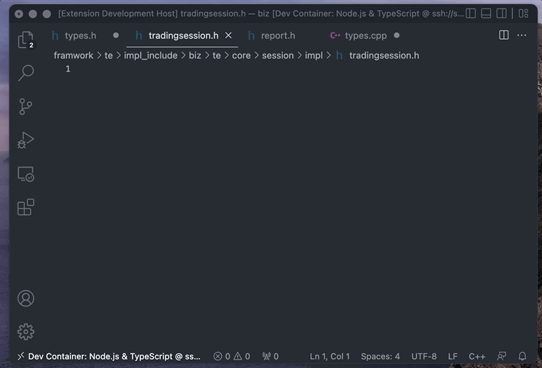
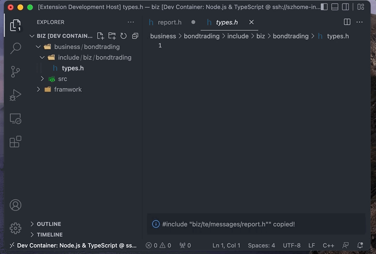
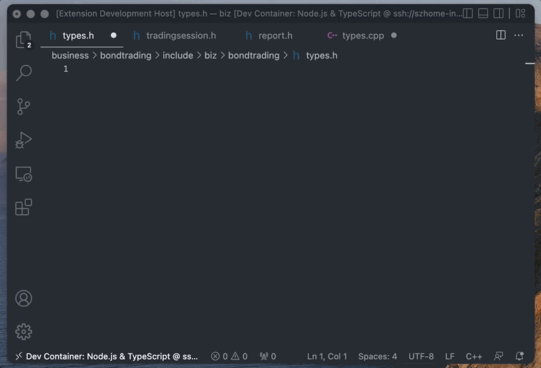

# EzInclude

C/C++ developers write `#include` a lot. Though language servers can help, it's still boring and error-prone to typing it again and agin.

## Features
EzInclude use the trival strategy to extract the include directive.

For example, if your include file name is `/home/node/biz/business/bondtrading/include/biz/bondtrading/types.h`.

 would use keyword=`include` to locate and get the tail  `biz/bondtrading/types.h`

Finally, format it into `#include <biz/bondtrading/types.h>` and copy to the clipboard.

## Screenshot
### Copy #include of active file, from command palette

### Call from explorer context menu

### Call from editor tile

## Release Notes

### 0.0.1

Initial release. Support getting #include from current open file.

## Known issues
